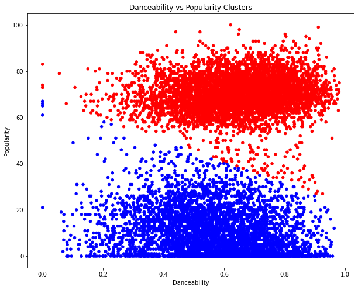
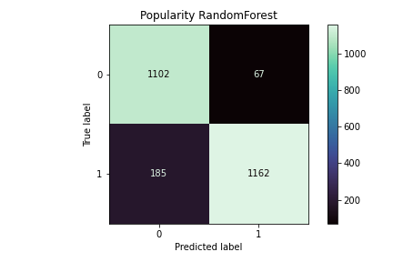

# Using Spotify API to Explore Audio Features, Song Popularity, and Genres

### By: Samuel Hewitt

## Problem Statement
Music streaming services have changed the metrics for a song/artist to be considered successful. The goal of this project is to determine if one can predict a song's popularity and success. I also aim to determine if a song's genre can be predicted based on it's audio features with disregard to the artist who made it.

## Data:
Data collected using Spotify’s Web API in hand with Spotipy, a lightweight Python library for Spotify Web API. Both require client credentials to collect data. Song data from past 10 years have been collected

## Software Requirements:
All data cleaning and modeling was run in Python using the following libraries:
Pandas, skLearn, matplotlib, Seaborn

Spotify Web Developer client credentials required for data collection

## Data Dictionaries

### Spotify Data Dictionary

|Feature|Type|Dataset|Description|
|---|---|---|---|
|**artist_name**|*str*|Spotify|The name of the artist.|
|**artist_genre**|*str*|Spotify|The genre(s) of the artist.|
|**track_name**|*str*|Spotify|The name of the track.|
|**track_id**|*str*|Spotify|The Spotify ID for the track.|
|**popularity**|*int*|Spotify|The popularity of the track. The value will be between 0 and 100, with 100 being the most popular. The popularity of a track is a value between 0 and 100, with 100 being the most popular. The popularity is calculated by algorithm and is based, in the most part, on the total number of plays the track has had and how recent those plays are.|
|**danceability**|*float*|Spotify|Danceability describes how suitable a track is for dancing based on a combination of musical elements including tempo, rhythm stability, beat strength, and overall regularity. A value of 0.0 is least danceable and 1.0 is most danceable.|
|**energy**|*float*|Spotify|Energy is a measure from 0.0 to 1.0 and represents a perceptual measure of intensity and activity. Typically, energetic tracks feel fast, loud, and noisy.|
|**key**|*int*|Spotify|The key the track is in. Integers map to pitches using standard Pitch Class notation. E.g. 0 = C, 1 = C♯/D♭, 2 = D, and so on. If no key was detected, the value is -1.|
|**loudness**|*float*|Spotify|The overall loudness of a track in decibels (dB). Loudness values are averaged across the entire track and are useful for comparing relative loudness of tracks. Loudness is the quality of a sound that is the primary psychological correlate of physical strength (amplitude). Values typically range between -60 and 0 db.|
|**mode**|*int*|Spotify|Mode indicates the modality (major or minor) of a track, the type of scale from which its melodic content is derived. Major is represented by 1 and minor is 0.|
|**speechiness**|*float*|Spotify|Speechiness detects the presence of spoken words in a track. The more exclusively speech-like the recording (e.g. talk show, audio book, poetry), the closer to 1.0 the attribute value. Values above 0.66 describe tracks that are probably made entirely of spoken words. Values between 0.33 and 0.66 describe tracks that may contain both music and speech, either in sections or layered, including such cases as rap music. Values below 0.33 most likely represent music and other non-speech-like tracks.|
|**acousticness**|*float*|Spotify|A confidence measure from 0.0 to 1.0 of whether the track is acoustic. 1.0 represents high confidence the track is acoustic|
|**instrumentalness**|*float*|Spotify|Predicts whether a track contains no vocals. "Ooh" and "aah" sounds are treated as instrumental in this context. Rap or spoken word tracks are clearly "vocal". The closer the instrumentalness value is to 1.0, the greater likelihood the track contains no vocal content. Values above 0.5 are intended to represent instrumental tracks, but confidence is higher as the value approaches 1.0.|
|**liveness**|*float*|Spotify|Detects the presence of an audience in the recording. Higher liveness values represent an increased probability that the track was performed live. A value above 0.8 provides strong likelihood that the track is live.|
|**valence**|*float*|Spotify|A measure from 0.0 to 1.0 describing the musical positiveness conveyed by a track. Tracks with high valence sound more positive (e.g. happy, cheerful, euphoric), while tracks with low valence sound more negative (e.g. sad, depressed, angry).|
|**tempo**|*float*|Spotify|The overall estimated tempo of a track in beats per minute (BPM). In musical terminology, tempo is the speed or pace of a given piece and derives directly from the average beat duration.|
|**duration_ms**|*int*|Spotify|The duration of the track in milliseconds.|
|**time_signature**|*int*|Spotify|An estimated time signature. The time signature (meter) is a notational convention to specify how many beats are in each bar (or measure). The time signature ranges from 3 to 7 indicating time signatures of "3/4", to "7/4".|

**NOTE:** artist_genre was one-hot encoded for modeling. Doing so changes shape of dataframe from (10,064, 16) to (10,064, 2,588)

## Modeling:

### Regression Models:

#### Modeling - Popularity by Audio Features
The goal of the regression model was to predict a song's popularity based on its audio features. The best performing model was Random Forest. This model had a mean squared error of 621.52 and a training and testing r2 score of 0.9069 and 0.3497 respectively.

#### Modeling - Popularity by Audio Features & Genre
The goal of the regression model was to predict a song's popularity based on its audio features and genre. Nearly ~1,300 genres were one hot-encoded. The best performing model was RidgeCV. This model had a mean squared error of 285.31 and a training and testing r2 score of 0.8124 and 0.7015 respectively.

### Clustering:

The goal of KMeans clustering was to find different clusters of data correlating danceability to popularity. The largest silhouette score was of 0.4905 occured at 2 clusters. There is a clear gap in popularity between scores ~40 and ~50. Either songs are popular or not so popular, with very little in the middle ground. Very few songs have perfect popularity scores and are highly unlikely to remain there after some time. Given the timeframe of the data collected, it makes sense that most are on the lower end as music trends change over time. Other than people listening to songs from a previous decade for nostalgia, they are rarely considered highly popular.

### Classification Models:

Two separate models were set up for classification, the first being the 'Classifying Popularity Based on Audio Features and Genre' and the second being 'Classifying Genre Based on Audio Features'. For this classification, the best model was a Random Forest model, with an accuracy score of 0.899 for the test data set.

The second classification model was a multiclass model, where genres were split up. Spotify gives an artist's genres in a list (ie Frank Ocean has the following genres: hip hop, lgbtq+ hip hop, neo soul, and pop) Each artist's tracks were split into each genre. Doing so more than tripled the size of the data frame. Random Forest has the best accuracy score on the training set, with a score of 0.3416, but was severly overfit with test accuracy score of 0.0225. The best model was Logisitc Regression, with an accuracy score of 0.0758. 

These results show that despite Spotify's audio features, they cannot be used to accurately determine a song's genre.
  

### Tableau Dashboard

https://public.tableau.com/views/SpotifyCapstonev2/Dashboard2?:language=en-US&publish=yes&:display_count=n&:origin=viz_share_link

## Conclusion:

There are many aspects that goes into a song's popularity, with a significant amount of them being unpredictable. Other medias influence a song's popularity. TikTok, movies, and televison shows all affect a song's popularity. An excellent example is Kate Bush's 'Running Up That Hill', which its popularity resurgence propelled by Netflix's fourth season of 'Stranger Things' despite being originally released in 1985. Although it is hard to predict a song's popularity, an artist's genre does have influence on popularity. Pop, hip hop, and rap are the most populary genres currently, which differs from the most popular genres of 1985.

## Next Steps:

* Repull data periodically as popularity changes day-to-day. 
* Errors with API where genre is not present for multiple artists, may be solved with data repulling
* Collaboration with other medias to determine trends and potential prospects for a song to gain popularity (ie used in popular show or new TikTok trend)